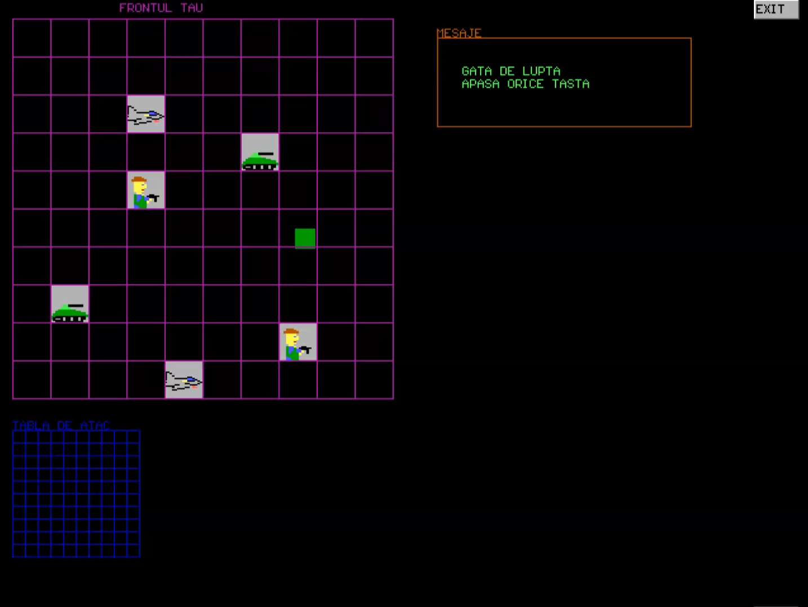

# soldiers-tanks-planes-game

A very basic game written in C with graphics.h

The game play is pretty simple. Both the player and the computer have a 10x10 board where they randomly arrange soldiers, tanks and planes. Then they take turns to kill each other’s army.

The implementation includes a graphical interface with a mouse cursor, buttons and menus from the GUI.H library

Checkout the demo by clicking the screenshot below

 
